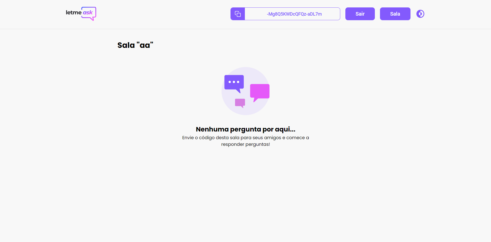
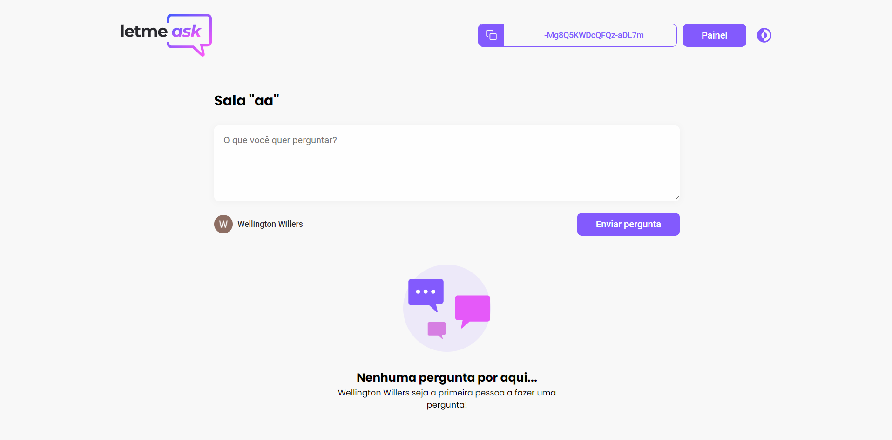

<div id="sobre"> 
  <h1>:purple_circle: LetmeAsk</h1>
  
  [](https://GitHub.com/Naereen/ama) [](https://open.vscode.dev/Naereen/badges) [](https://github.com/Naereen/StrapDown.js/blob/master/LICENSE)
  <p>
    Projeto realizado durante a 6ª edição do NLW apresentado pela Rocketseat. 
    O projeto consiste em uma plataforma, onde o usuário acessa a partir de sua conta do Google, para fazer perguntas ao usuário responsável pela sala.
  </p>
  
  <h4> 
    🚧  React Select 🚀 Em construção...  🚧
  </h4>
</div>


<div id="tabela-de-conteudo"> 
  <h1>:purple_circle: Tabela de conteúdos</h1>
  
  <p align="center">
    <a href="#sobre">Sobre</a> •
    <a href="#tabela-de-conteudo"> Tabela de conteúdo</a> • 
    <a href="#tecnologias-usadas"> Tecnologias usadas</a> • 
    <a href="#requisitos"> Requisitos</a> • 
    <a href="#instalacao"> Instalação</a> • 
    <a href="#screenshots"> Prints de tela</a> • 
   <a href="#autor"> Autor</a>
  </p>
</div>

<div id="tecnologias-usadas"> 
  <h1> :purple_circle: Tecnologias usadas</h1>
 </div>
 
- [ReactJS](https://reactjs.org/) + [Typescript](https://www.typescriptlang.org/)
- [Styled-components](https://styled-components.com/)
- [Firebase](https://firebase.google.com/)
- [react-router-dom](https://reactrouter.com/web/guides/quick-start)


<div id="tecnologias-usadas"> 
  <h1>:purple_circle: Features</h1>
</div>

- [x] Login com google
- [x] Light/Dark theme
- [x] Styled component
- [x] Responsividade
- [x] Notificação Toast
- [x] Tratamento de erros
- [x] Salvando Theme color no LocalStorege
- [x] ThemeContext/Hooks
- [ ] Desenvolvimento de uma API
- [ ] Opção de responder no admin
- [ ] Adicionar a opção de banco de dados
- [ ] ...


<div id="requisitos"> 
  <h1>:purple_circle: Requisitos</h1>
</div>

Antes de começar, você vai precisar ter instalado em sua máquina as seguintes ferramentas:
[Git](https://git-scm.com), [Node.js](https://nodejs.org/en/). 
Além disto é bom ter um editor para trabalhar com o código como [Visual Studio Code](https://code.visualstudio.com/)

<div id="instalacao"> 
  <h1>:purple_circle: Instalação</h1>
</div>

```bash
# Clone este repositório
$ git clone <https://github.com/WelliWillers/letmeask.git>

# Acesse a pasta do projeto no terminal/cmd
$ cd letmeask

# Instale as dependências
$ npm install

# Execute a aplicação em modo de desenvolvimento
$ yarn start

# A aplicação inciará na porta:3333 - acesse <http://localhost:3333> - **deve abrir automaticamente
```

<div id="screenshots"> 
  <h1>:purple_circle: Prints de tela</h1>
</div>




<div id="autor"> 
  <h1>:purple_circle: Autor</h1>
</div>

<a href="https://github.com/WelliWillers">
 
 <br />
 <sub><b>Wellington Willers</b></sub></a> 🚀

👋🏽 Entre em contato!

[](https://www.linkedin.com/in/wellington-willers-24302b199/) 
[](mailto:wellington.willer@gmail.com)
