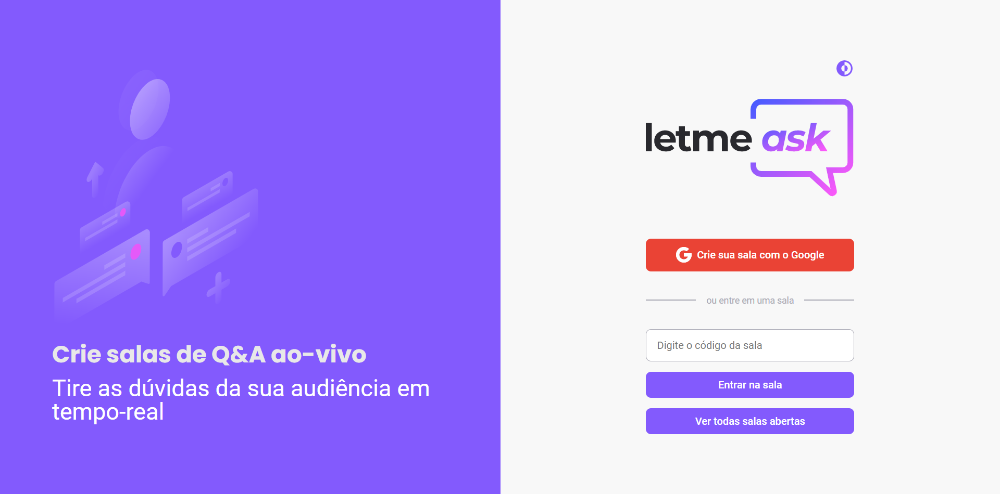

<h1 align="center">
  
  
  
</h1>

 
  :purple_circle: Sobre
  <h1 align="center">LetmeAsk</h1>
  
    
  

    Projeto realizado durante a 6ª edição do NLW apresentado pela Rocketseat. 
    O projeto consiste em uma plataforma, onde o usuário acessa a partir de sua conta do Google, para fazer perguntas ao usuário responsável pela sala.
  

  
  <h4 align="center"> 
    🚧  React Select 🚀 Em construção...  🚧
  </h4>

## :purple_circle: Tabela de conteúdos

## :purple_circle: Tecnologias usadas

- [ReactJS](https://reactjs.org/) + [Typescript](https://www.typescriptlang.org/)
- [Styled-components](https://styled-components.com/)
- [Styled-react-modal](https://github.com/AlexanderRichey/styled-react-modal#readme)
- [Firebase](https://firebase.google.com/)
- [react-router-dom](https://reactrouter.com/web/guides/quick-start)

